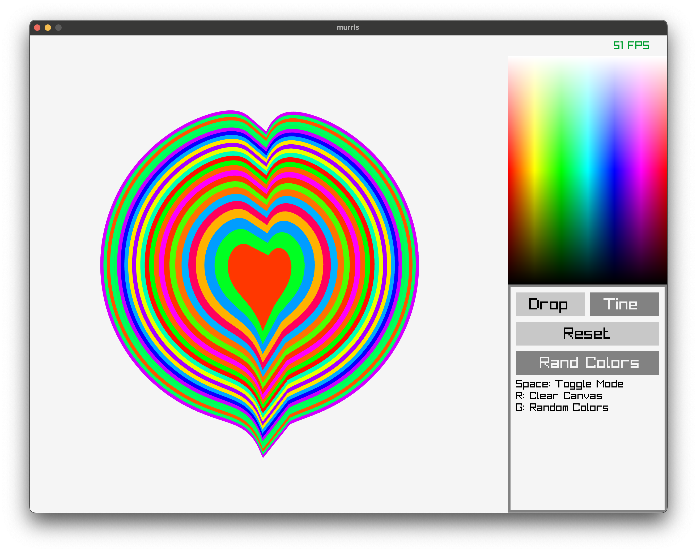

# murrls

A simple paper marbling program inspired by [Daniel Shiffman's Coding Challenge #183](https://www.youtube.com/watch?v=p7IGZTjC008).
One main reason to make this is because Dana finally woke up from her slumber
and decided to code something today xD

## TODO

- [x] Ink drop
- [x] Tine line
- [x] A mode to switch between the two (space button)
- [x] Some GUI buttons
- [x] Colors
- [x] Add example GIF in README.md

Marblind drops:

Tine drops:
